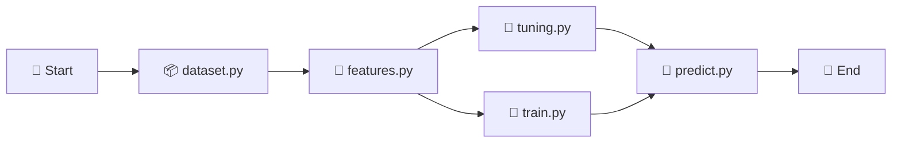

# time-series-prediction-rnn

## Aboult

This project implements a robust time series forecasting pipeline to predict the closing prices of the IBOVESPA index, Brazil’s main stock market benchmark. It combines advanced data preprocessing techniques using scikit-learn with a deep learning architecture that integrates convolutional layers (Conv1D), recurrent layers (LSTM and GRU), and dense layers. The model incorporates regularization (L2) and dropout to prevent overfitting. Additionally, the training experiments and results are systematically tracked using MLflow to ensure reproducibility and facilitate hyperparameter tuning.

Key features include:
- Data normalization and inverse transformation with scikit-learn for effective model training and interpretability.
- A hybrid neural network architecture designed for sequential financial data.
- Use of MLflow for experiment tracking and model management.
- Modular codebase enabling experimentation with training parameters and architectures.

## 🛠️ Installation (CLI)

Run the following commands in your terminal (requires-python = "~=3.10.0"):

#### 1. Clone the repository
```bash
git clone https://github.com/moreira-and/time-series-prediction-rnn.git
cd time-series-prediction-rnn
```

#### 2. (Optional) Create and activate a virtual environment
```bash
python -m venv .venv
.env\Scripts\activate   # On Linux e macOS: source .venv/bin/activate
```

#### 3. Install dependencies
```bash
pip install -r requirements.txt
```

## Project flow

Open the notebook [0.0-amp-main.ipynb](/notebooks/0.0-amp-main.ipynb) and run all cells.



## Project Organization

<a target="_blank" href="https://cookiecutter-data-science.drivendata.org/">
    
</a>

```
├── LICENSE            <- Open-source license if one is chosen
├── Makefile           <- Makefile with convenience commands like `make data` or `make train`
├── README.md          <- The top-level README for developers using this project.
├── data
│   ├── external       <- Data from third party sources.
│   ├── interim        <- Intermediate data that has been transformed.
│   ├── processed      <- The final, canonical data sets for modeling.
│   └── raw            <- The original, immutable data dump.
│
├── docs               <- A default mkdocs project; see www.mkdocs.org for details
│
├── models             <- Trained and serialized models, model predictions, or model summaries
│
├── notebooks          <- Jupyter notebooks. Naming convention is a number (for ordering),
│                         the creator's initials, and a short `-` delimited description, e.g.
│                         `1.0-jqp-initial-data-exploration`.
│
├── pyproject.toml     <- Project configuration file with package metadata for 
│                         src and configuration for tools like black
│
├── references         <- Data dictionaries, manuals, and all other explanatory materials.
│
├── reports            <- Generated analysis as HTML, PDF, LaTeX, etc.
│   └── figures        <- Generated graphics and figures to be used in reporting
│
├── requirements.txt   <- The requirements file for reproducing the analysis environment, e.g.
│                         generated with `pip freeze > requirements.txt`
│
├── setup.cfg          <- Configuration file for flake8
│
└── src   <- Source code for use in this project.
    │
    ├── __init__.py             <- Makes src a Python module
    │
    ├── config.py               <- Store useful variables and configuration
    │
    ├── dataset.py              <- Scripts to download or generate data
    │
    ├── features.py             <- Code to create features for modeling
    │
    ├── modeling                
    │   ├── __init__.py 
    │   ├── predict.py          <- Code to run model inference with trained models          
    │   └── train.py            <- Code to train models
    │
    └── plots.py                <- Code to create visualizations
```

--------

