# time-series-prediction-rnn

## Aboult

This project implements a robust time series forecasting pipeline to predict the closing prices of the IBOVESPA index, Brazil’s main stock market benchmark. It combines advanced data preprocessing techniques using scikit-learn with a deep learning architecture that integrates convolutional layers (Conv1D), recurrent layers (LSTM and GRU), and dense layers. The model incorporates regularization (L2) and dropout to prevent overfitting. Additionally, the training experiments and results are systematically tracked using MLflow to ensure reproducibility and facilitate hyperparameter tuning.

### Project flow

Open the notebook [0.0-amp-main.ipynb](/notebooks/0.0-amp-main.ipynb) and run all cells.

```mermaid
flowchart LR
    A["🔄 Start"]
    B["📦 dataset.py"]
    C["🧮 features.py"]
    D["🎯 tuning.py"]
    E["🤖 train.py"]
    F["🔮 predict.py"]
    G["🏁 End"]

    A --> B --> C
    C --> D
    C --> E
    D --> F
    E --> F
    F --> G
```



### Key features include:
- Data normalization and inverse transformation with scikit-learn for effective model training and interpretability.
- A hybrid neural network architecture designed for sequential financial data.
- Use of MLflow for experiment tracking and model management.
- Modular codebase enabling experimentation with training parameters and architectures.

### Technical Highlights:
- Modular architecture with strategy and template patterns for easy extensibility and maintenance.
- Reproducible ML pipelines orchestrated and tracked with MLflow.
- Decoupled configuration using .yaml files.
- Integration with notebooks and dashboards for data exploration and results presentation.
- Clear separation of concerns between ingestion, transformation, modeling, and visualization.

## 🛠️ Installation (CLI)

Run the following commands in your terminal (requires-python = "~=3.10.0"):

#### 1. Clone the repository
```bash
git clone https://github.com/moreira-and/time-series-prediction-rnn.git
cd time-series-prediction-rnn
```

#### 2. (Optional) Create and activate a virtual environment
```bash
python -m venv .venv
.env\Scripts\activate   # On Linux e macOS: source .venv/bin/activate
```

#### 3. Install dependencies
```bash
pip install -r requirements.txt
```

## Project Organization

<a target="_blank" href="https://cookiecutter-data-science.drivendata.org/">
    
</a>

```
├── LICENSE                  <- Project license.
├── Makefile                 <- Utility commands for automation (e.g., make train).
├── README.md                <- Main project description.
├── configs/                 <- YAML configuration files for datasets.
│   ├── dataset.yaml         <- Input parameters, normalization, and splits.
│   └── model.yaml           <- Model architecture and hyperparameters.
├── data/                    <- Data organized by processing stage.
│   ├── raw/                 <- Raw, original data.
│   ├── processed/           <- Data prepared for modeling (arrays, pickles).
│   └── predicted/           <- Prediction results in production.
├── docs/                    <- Project documentation (e.g., mkdocs).
├── mlruns/                  <- Directory managed by MLflow (experiment tracking).
├── models/                  <- Trained and serialized models (.h5, .pkl, etc.).
├── notebooks/               <- Notebooks for experimentation and exploration.
│   └── 0.0-amp-main.ipynb   <- Main project execution pipeline.
├── pyproject.toml           <- Python package metadata and configurations.
├── references/              <- Data dictionaries and supporting materials.
├── reports/                 <- Analytical outputs (reports, charts, dashboards).
│   ├── figures/             <- Automatically generated figures.
│   └── pbi/                 <- Power BI dashboards (e.g., amp-fynance.pbip).
├── requirements.txt         <- Python dependencies.
├── src/                     <- Core project source code.
│   ├── config.py            <- Global variables and configuration loading.
│   ├── dataset.py           <- Data loading and orchestration logic.
│   ├── features.py          <- Feature extraction from data.
│   ├── modeling/            <- Model training, tuning, and prediction.
│   │   ├── train.py
│   │   ├── tune.py
│   │   └── predict.py
│   ├── plots.py             <- Custom plotting and visualization.
│   └── utils/               <- Domain-specific strategies and utilities.
│       ├── dataset/         <- Cleaning, calendar, and loading strategies.
│       ├── features/        <- Pre/post processors, splitters, transformers.
│       ├── log/             <- Custom logging strategies.
│       ├── predict/         <- Templates and wrappers for prediction and MLflow.
│       ├── train/           <- Callbacks, compilation, and training templates.
│       └── tune/            <- Hyperparameter tuning strategies.
└── tests/                   <- Automated unit and integration tests.
```

--------

